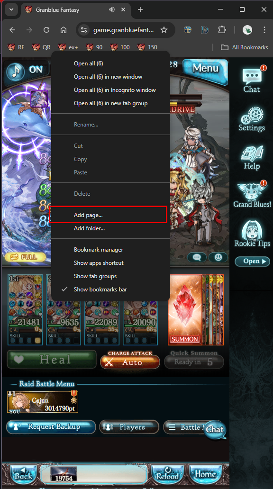
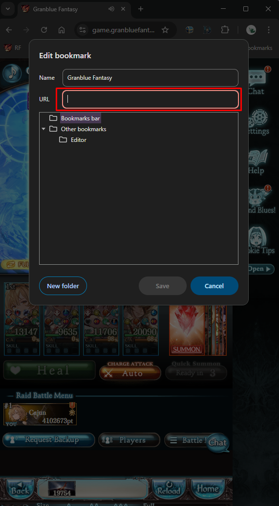

# GBF Party Wiki Exporter

Bookmarklet that generates a gbf.wiki formatted TeamSpread of the currently open team page and copies it to your clipboard.

## Installation

- Copy [this](https://raw.githubusercontent.com/cajunwildcat/GBF-Party-Parser/main/bookmarklet) code and paste it into the URL bar of a new bookmark in the browser you use to play GBF.
  
  - <b>Make sure to clear the url field before pasting!<b>
- Go to a party team and click the bookmark
- Click the okay button in the pop-up to have the team copied to your clipboard for easy pasting access.

## Why use this bookmarklet

This bookmarklet makes use of a kept up to date databse of character and summon IDs in this repo to get more accurate names. This means it is able to accurate differentiate between characters with multiple versions such as `Vira` and `Vira (Grand)`. The names are set according to the page names on the gbf.wiki so you should not have to edit anything.

A smaller feature, but opening the estimated damage panel in order to get more accurate Support Summon data.

## Limitations

- Newly added characters and summons will not be grabbed properly and break functionality. Please wait a day or two after their release before using the bookmarklet on teams including them.
- To get more accurate Support Summon data (LB & Transcendence) you have to open the Estimated Damage panel at least once. Afterwards you can close it and use the bookmark as much as you want until you reload the page or switch teams.
  - Otherwise only the summon name will be filled out.
- More detailed information about characters such as their EMPs or Awakening is not available to be extracted from the game on the team page, so these cannot be automatically filled out.

## Developer Installation

Using node you can auto build a bookmarklet from the code in `wiki-exporter.js`.
 - Setup the node packages with `npm isntall`
 - Afterwards you use `npm run build` to replace the content of `bookmarklet` with an update verison from the current version of `wiki-exporter.js`
 - If you want to change the input/output file you can use `npx bookmarklet <source> <destination>` or edit the `build` command in `package.json`

## Update Log
Version 3.52 (03/11/2025)
 - Fixed support summon & sub summon 2 bug

Version 3.51 (01/11/2025)
 - Fixed issue with support summon output

Version 3.5 (30/10/2025)
 - Character awakenings other than balanced will automatically be filled out
 - Fixed issue with max uncapped sub summons not removing uncap param

Version 3.4 (26/10/2025)
 - Added support for Destroyer Weapon keys

Version 3.31 (04/10/2025)
 - Names are now trimmed
  - Thanks mugen blade

Version 3.3 (15/07/2025)
 - Migrated data storage a new repo, removed existing data from this repo and updated fetch links as part of bookmarklets

Version 3.2 (25/06/2025)
 - Changed how EX2 CCW skills are recorded 
  - fixes Row IV CCWs adding ccw param to export
 - Fixed Team's main/support summons adding art=A

Version 3.11 (09/05/2025)
 - 5* Dark Opus no longer add uncap to export

Version 3.1 (08/04/2025)
 - Fixed Eternals transcendence being based on level instead of phase param

Version 3.04 (07/04/2025)
 - Fixed Row 5 CCWs no having element added to their name

Version 3.0 (23/03/2025)
 - Uncap level is now only exported when not max for the respective weapon/summon
 - Support Summon name should be correct more often when full details are not grabbed
 - Row 5 CCWs no longer export a pointless `|ccw` value

Version 2.92 (13/03/2025)
 - Fixed shield parsing issue

Version 2.91 (30/01/2024)
 - Changed Ultima Weapons add element in their name when they are grid slots 1-12, except classes that use the auxilary weapon system which keep the element for off-hand purposes.

Version 2.9 (28/01/2024)
 - Fixed Varuna support summon not being assumed to be transcended

Version 2.8 (19/09/2024)
 - Added new manaturas and shields

Version 2.7 (01/08/2024):
 - Added support for Paladin and Shieldsworn shields
 - Class skill names with alternate names now properly set the entire name

Version 2.61 (30/06/2024):
 - Fixed typo that prevented grabbing character name when character is not in databse.

Version 2.6 (22/06/2024):
 - Fixed issue with summons who have (Summon) in their wiki name not retaining it when used as support summons.

Version 2.52 (03/06/2024):
 - Update alert no longer cancels the bookmarklet automatically. Instead the alert now has a cancel button which will not open the hosting repo in a new tab and copy the data as normal.

Version 2.51 (03/06/2024):
 - Support Summon assumptions now include Leviathan Omega and Yggdrasil Omega

Version 2.5 (17/05/2024):
 - Fixed element being added to stage 3 replica CCW names

Version 2.4 (10/05/2024):
 - Added element to Superlative weapon names

Version 2.31:
 - Fixed silent error when character slots are empty

Version 2.3 (05/05/2024):
 - Added support for manadiver minos
 - Fixed issue of Support Summon using old data when switching parties and not refreshing or re-opening estimated damage panel
 - Added failsafe for if character or summon is not found in databses
  - The display name of the character will be used instead. Manually adding wiki specifiers like (Grand) or (Summer) might be required after the fact.
 - Reduced the time that character and summon databases are cached to 12 hours instead of 24
  - This is subject to change and might be removed in the future to use the default cache behavior
 - Added assumptions for Support Summons for the Providence, Optimus, and Omega series
  - If detailed Supprt Summon data is not available (the estimated damage panel hasn't been opened) these summons will be assumed to be max uncap and transcendence (except levi and yggy omega since M3 for those has not been released yet)

Version 2.2b (no version update):
 - Added Github Action workflow for updating `summons.json` and `characters.json` daily at midnight.

Version 2.2:
 - Updated summon uncaps to not include the max uncap specifier (mlb,flb,tlb) in accordance with the updated SummonGrid template on the wiki.
  - As such, `summons.json` no longer has data for `evo_max` of each summon.

Version 2.1: 
 - Fixed an issue with Support Summon parsing

Version 2 (04/05/2024):
 - Changed from making API calls to the gbf.wiki to fetching a static database in this repo that will be manually updated
 - Refactored some code in reference to the above and extrapolating filling out summon data for main and sub summons to a helper function
 - Released as a publicly available verison!

Version 1.2:
 - Fixed support for character transcendence
 - Fixed caching of version number
 - Used better JS minifier extrapolated setting character data in TeamSpread to helper functions

Version 1.1:
 - Fixed support summons incorrectly getting transcendence levels
 - Fixed Ultima and CCW Weapons not having their element in their names
 - Changed character art to be based on uncap level instead of currently set art
 - Extrapolated setting weapon data in TeamSpread to helper functions

Version 1 (01/05/2024):
 - First "complete" version with features for exporting regular parties with correct wiki name for character variants
